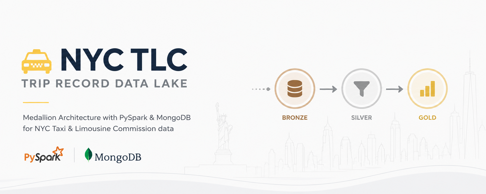
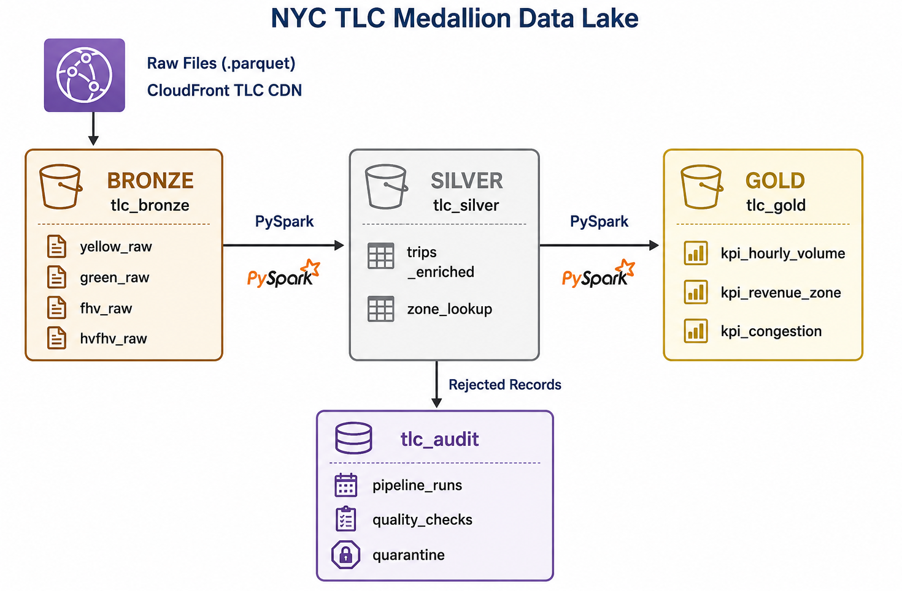
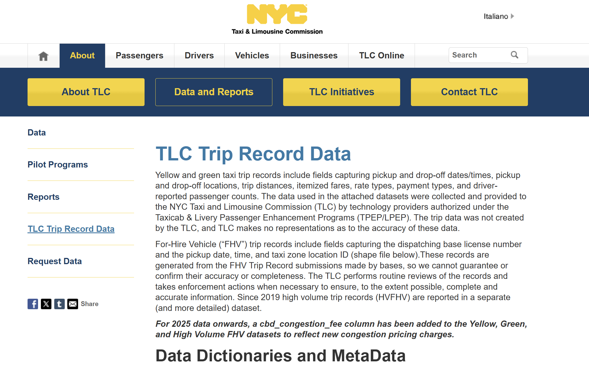

# NYC TLC Trip Record Data — Medallion Data Lake

      

A scalable, production-grade data lake implementing the **Medallion Architecture** (Bronze → Silver → Gold) for processing NYC Taxi and Limousine Commission (TLC) trip records. Built with **Apache PySpark** for distributed transformation and **MongoDB** as the unified storage layer across all layers.

---

## Table of Contents

- [Overview](#overview)
- [Architecture](#architecture)
- [Dataset](#dataset)
- [Project Structure](#project-structure)
- [Getting Started](#getting-started)
- [Pipeline Overview](#pipeline-overview)
- [Audit Framework](#audit-framework)
- [Configuration](#configuration)
- [Contributing](#contributing)
- [License](#license)

---

## Overview

The NYC TLC dataset is one of the largest publicly available urban mobility datasets, containing hundreds of millions of trip records from Yellow Taxis, Green Taxis, For-Hire Vehicles (FHV), and High-Volume FHV services operating in New York City.

This project provides a complete, reproducible data engineering pipeline that:

- **Ingests** raw `.parquet` files from the TLC data portal into a Bronze layer.
- **Cleans and enriches** trip records in the Silver layer, applying data quality rules and performing spatial joins with TLC taxi zone metadata.
- **Aggregates** business-ready KPIs and metrics into a Gold layer for analytics consumption.
- **Audits** every pipeline execution end-to-end, logging quality check results, quarantined records, and execution metadata directly into MongoDB.

### Key Design Decisions

| Decision | Rationale |
|---|---|
| **MongoDB as single store** | Schema flexibility accommodates structural differences between Yellow, Green, FHV, and HVFHV datasets (e.g., `cbd_congestion_fee` present only in 2025+ records). |
| **PySpark for all transformations** | Handles the scale of 100M+ records without memory constraints; enables broadcast joins for lookup enrichment. |
| **Medallion Architecture** | Clear separation of concerns between raw ingestion, curated data, and business aggregations. Supports data reprocessing at any layer. |
| **Centralized Audit in MongoDB** | All pipeline execution logs, quality check results, and quarantined records are stored in `tlc_audit` for cross-layer traceability. |

---

## Architecture



---

## Dataset

Trip data is sourced from the official **TLC Trip Record Data** website:
- **Official Page**: [TLC Trip Record Data](https://www.nyc.gov/site/tlc/about/tlc-trip-record-data.page)
- **Data Repository (CDN)**: [AWS CloudFront Trip Data Portal](https://d37ci6vzurychx.cloudfront.net/trip-data/)

### About the Dataset

The NYC Taxi and Limousine Commission (TLC) collects and provides trip records for various types of taxi and for-hire services operating in New York City:
- **Yellow and Green Taxis**: Includes fields capturing pickup/drop-off times and locations, trip distances, itemized fares, rate types, payment types, and driver-reported passenger counts.
- **For-Hire Vehicles (FHVs)**: Includes fields capturing the dispatching base license number, pickup time/date, and taxi zone location ID.
- **High-Volume FHVs (HVFHVs)**: Since 2019, high-volume services (like Uber and Lyft) are reported in a separate, more detailed dataset.

### Data Dictionaries & Metadata

You can find the official user guides and schemas on the [official TLC page](https://www.nyc.gov/site/tlc/about/tlc-trip-record-data.page):
- [Trip Record User Guide](https://www.nyc.gov/assets/tlc/downloads/pdf/trip_record_user_guide.pdf)
- [Yellow Trips Data Dictionary](https://www.nyc.gov/assets/tlc/downloads/pdf/data_dictionary_trip_records_yellow.pdf)
- [Green Trips Data Dictionary](https://www.nyc.gov/assets/tlc/downloads/pdf/data_dictionary_trip_records_green.pdf)
- [FHV Trips Data Dictionary](https://www.nyc.gov/assets/tlc/downloads/pdf/data_dictionary_trip_records_fhv.pdf)
- [High Volume FHV Trips Data Dictionary](https://www.nyc.gov/assets/tlc/downloads/pdf/data_dictionary_trip_records_hvfhs.pdf)

### Official TLC Page Reference



### Available Vehicle Types

| Type | File Pattern | Description |
|---|---|---|
| Yellow Taxi | `yellow_tripdata_YYYY-MM.parquet` | Yellow medallion cabs |
| Green Taxi | `green_tripdata_YYYY-MM.parquet` | Boro/street-hail livery cabs |
| FHV | `fhv_tripdata_YYYY-MM.parquet` | For-Hire Vehicles (Uber, Lyft, etc.) |
| HVFHV | `fhv_tripdata_YYYY-MM.parquet` | High-Volume FHV (2019+) |

### Key Dataset Fields

| Field | Type | Description |
|---|---|---|
| `tpep_pickup_datetime` | Timestamp | Trip start time (Yellow) |
| `lpep_pickup_datetime` | Timestamp | Trip start time (Green) |
| `PULocationID` / `DOLocationID` | Integer | TLC Taxi Zone IDs (1–265) |
| `trip_distance` | Float | Distance in miles |
| `fare_amount` | Float | Metered fare |
| `total_amount` | Float | Total charge including all fees |
| `cbd_congestion_fee` | Float | NYC Congestion Pricing surcharge **(2025+)** |
| `payment_type` | Integer | 1=Credit, 2=Cash, 3=No charge, 4=Dispute |
| `passenger_count` | Integer | Driver-reported passenger count |

### Lookup Files

| File | Description |
|---|---|
| `taxi_zone_lookup.csv` | Maps `LocationID` → `Borough`, `Zone`, `service_zone` |
| `taxi_zones.zip` | Shapefile for spatial analysis |

---

## Project Structure

```
nyc-tlc/
│
├── core/                           # Reusable framework (no business logic)
│   ├── audit/
│   │   ├── control_manager.py      # Pipeline lifecycle & audit trail
│   │   ├── quality.py              # Data quality check models
│   │   └── logger.py               # Structured logging setup
│   ├── config/
│   │   └── settings.py             # Centralized config via Pydantic/env vars
│   └── storage/
│       └── mongo_client.py         # MongoDB connection factory
│
├── src/                            # Domain-specific transformations
│   ├── spark_utils.py              # SparkSession factory with Mongo connector
│   ├── paths.py                    # Dataset path resolver by vehicle type & year
│   └── transformations/
│       ├── tlc_rules.py            # Data quality filter rules
│       ├── enrichment.py           # Zone lookup broadcast join logic
│       └── schema.py               # Silver document schema builder
│
├── notebooks/                      # Execution notebooks (one per pipeline stage)
│   ├── 00_setup_download.ipynb     # Download raw .parquet files by year/type
│   ├── 01_bronze_ingestion.ipynb   # Raw ingest → tlc_bronze
│   ├── 02_silver_yellow.ipynb      # Yellow clean + enrich → tlc_silver
│   ├── 03_silver_green.ipynb       # Green clean + enrich → tlc_silver
│   ├── 04_gold_metrics.ipynb       # Aggregations → tlc_gold
│   └── 05_exploratory_analysis.ipynb # Ad-hoc queries against Silver/Gold
│
├── tests/                          # Unit and integration tests
│   ├── test_control_manager.py
│   └── test_tlc_rules.py
│
├── docs/                           # Extended documentation
│   ├── data_dictionary.md
│   └── audit_schema.md
│
├── data/                           # Local data directory (git-ignored)
│   ├── raw/
│   │   ├── yellow/                 # yellow_tripdata_YYYY-MM.parquet
│   │   ├── green/                  # green_tripdata_YYYY-MM.parquet
│   │   ├── fhv/                    # fhv_tripdata_YYYY-MM.parquet
│   │   ├── hvfhv/                  # fhvhv_tripdata_YYYY-MM.parquet
│   │   └── lookup/                 # taxi_zone_lookup.csv
│   └── audit/
│       └── executions/             # Local JSON audit backup
│
├── logs/                           # Pipeline execution logs
├── assets/                         # Architecture diagrams, images
│
├── .env.example                    # Environment variable template
├── .gitignore
├── docker-compose.yml              # MongoDB + Jupyter PySpark stack
├── Dockerfile                      # Custom Jupyter image with Mongo connector
├── requirements.txt
├── requirements-dev.txt
└── README.md
```

---

## Getting Started

### Prerequisites

- Docker Desktop (with WSL2 backend on Windows)
- Python 3.11+

### 1. Clone and Configure

```bash
git clone <repository-url>
cd nyc-tlc
cp .env.example .env
# Edit .env with your desired MongoDB credentials
```

### 2. Start the Infrastructure

```bash
docker compose up -d
```

This starts:
- **MongoDB 7.0** on `localhost:27017`
- **Jupyter PySpark** (with Mongo Spark Connector) on `localhost:8100`

### 3. Download Raw Data

Open `notebooks/00_setup_download.ipynb` in Jupyter and configure the desired years:

```python
YEARS = [2024, 2025]
VEHICLE_TYPES = ["yellow", "green"]  # Add "fhv", "hvfhv" as needed
```

### 4. Run the Pipeline

Execute notebooks in order:

```
00_setup_download.ipynb  →  01_bronze_ingestion.ipynb  →
02_silver_yellow.ipynb   →  04_gold_metrics.ipynb
```

---

## Pipeline Overview

### Bronze Layer — Raw Ingestion

Every raw `.parquet` file is loaded as-is into MongoDB. Each document is augmented with:

```json
{
  "_meta": {
    "ingestion_time": "2026-07-03T05:00:00Z",
    "source_file": "yellow_tripdata_2025-01.parquet",
    "run_id": "a1b2c3d4",
    "vehicle_type": "yellow"
  }
}
```

No transformations. No filters. Full fidelity.

### Silver Layer — Cleaning & Enrichment

Applied rules per vehicle type:

| Rule | Action |
|---|---|
| `trip_distance <= 0` | → Quarantine |
| `fare_amount < 0` | → Quarantine |
| `pickup_datetime > dropoff_datetime` | → Quarantine |
| `PULocationID` not in [1, 265] | → Quarantine |
| Valid records | → Enrich with Zone names → Silver |

Each Silver document adopts a normalized nested structure:

```json
{
  "vehicle_type": "yellow",
  "datetimes": { "pickup": ISODate, "dropoff": ISODate, "duration_minutes": 18.5 },
  "locations": {
    "pickup":  { "zone_id": 142, "borough": "Manhattan", "zone_name": "Lincoln Square East" },
    "dropoff": { "zone_id": 230, "borough": "Manhattan", "zone_name": "Times Sq/Theater Dist" }
  },
  "metrics":  { "distance_miles": 4.2, "passenger_count": 2 },
  "financials": {
    "fare_amount": 18.50, "tip_amount": 3.00, "tolls_amount": 0.0,
    "cbd_congestion_fee": 2.75,
    "total_amount": 24.25, "payment_type": "Credit Card"
  },
  "_meta": { "run_id": "a1b2c3d4", "processed_at": ISODate, "source_year": 2025 }
}
```

### Gold Layer — Business Aggregations

Pre-computed KPI collections in `tlc_gold`:

| Collection | Description |
|---|---|
| `kpi_hourly_volume` | Trip count & avg fare by hour × borough |
| `kpi_revenue_zone` | Revenue breakdown per pickup zone |
| `kpi_congestion_impact` | Congestion fee analysis (2025+ only) |
| `kpi_payment_trends` | Payment type distribution over time |

---

## Audit Framework

Every notebook execution is tracked end-to-end in `tlc_audit`:

### `pipeline_runs` collection

```json
{
  "execution_id": "a1b2c3d4",
  "pipeline_name": "silver_yellow",
  "status": "SUCCESS",
  "started_at": ISODate,
  "finished_at": ISODate,
  "duration_seconds": 312.4,
  "input_parameters": { "years": [2025], "months": [1, 2, 3] },
  "metrics": {
    "records_read_from_bronze": 1500000,
    "records_written_to_silver": 1498201,
    "records_quarantined": 1799
  },
  "quality_checks": [
    { "check_name": "negative_fares", "status": "PASSED", "records_failed": 0 },
    { "check_name": "zero_distance",  "status": "WARNING", "records_failed": 1799 }
  ]
}
```

### `quarantine` collection

```json
{
  "quarantined_at": ISODate,
  "run_id": "a1b2c3d4",
  "pipeline": "silver_yellow",
  "reason": "trip_distance <= 0",
  "raw_record": { ... }
}
```

---

## Configuration

All configuration is driven by environment variables. Copy `.env.example` to `.env` and adjust:

| Variable | Default | Description |
|---|---|---|
| `MONGO_HOST` | `mongodb` | MongoDB hostname |
| `MONGO_PORT` | `27017` | MongoDB port |
| `MONGO_USER` | `admin` | Admin username |
| `MONGO_PASSWORD` | `password123` | Admin password |
| `MONGO_AUTH_DB` | `admin` | Authentication database |
| `TLC_DATA_URL` | `https://d37ci6vzurychx.cloudfront.net/trip-data` | TLC CDN base URL |
| `PROJECT_ROOT` | `/home/jovyan/work` | Root path inside container |

---

## Contributing

1. Fork the repository.
2. Create a feature branch: `git checkout -b feature/your-feature`.
3. Commit your changes following [Conventional Commits](https://www.conventionalcommits.org/).
4. Open a Pull Request against `main`.

---

## License

This project is licensed under the MIT License - see the [LICENSE](LICENSE) file for details.

---

*Data sourced from the [NYC Taxi & Limousine Commission (TLC)](https://www.nyc.gov/site/tlc/about/tlc-trip-record-data.page). This project is for educational and research purposes only.*
