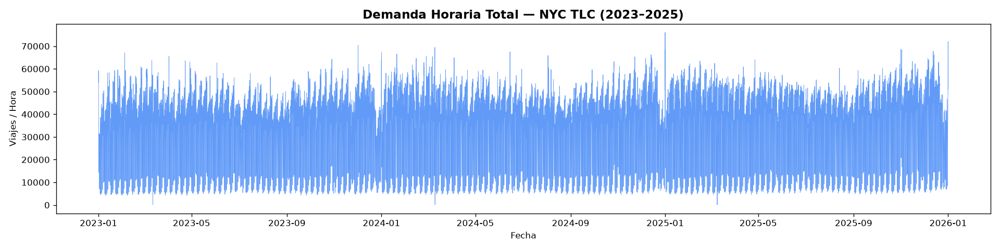
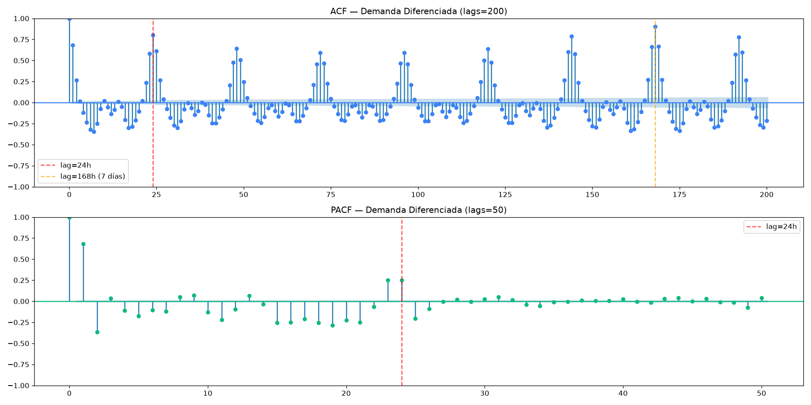
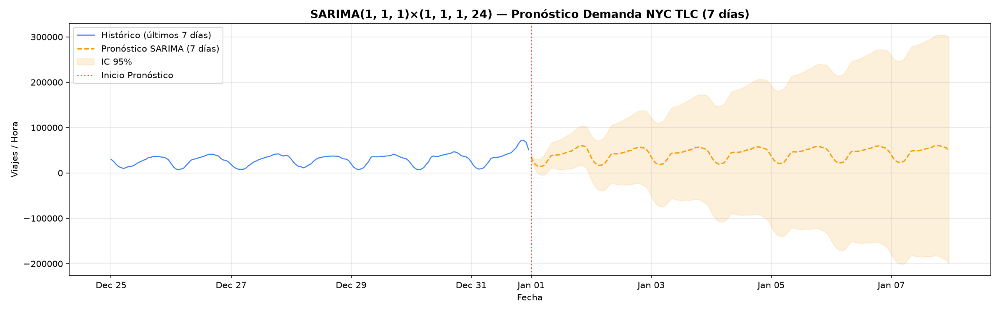
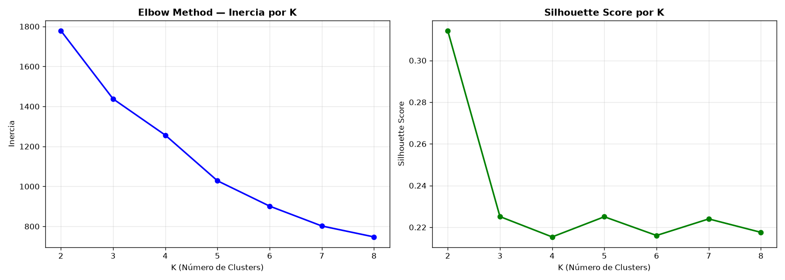
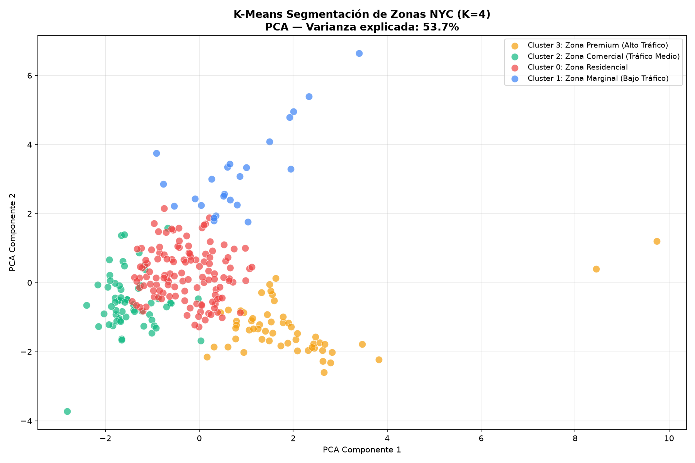
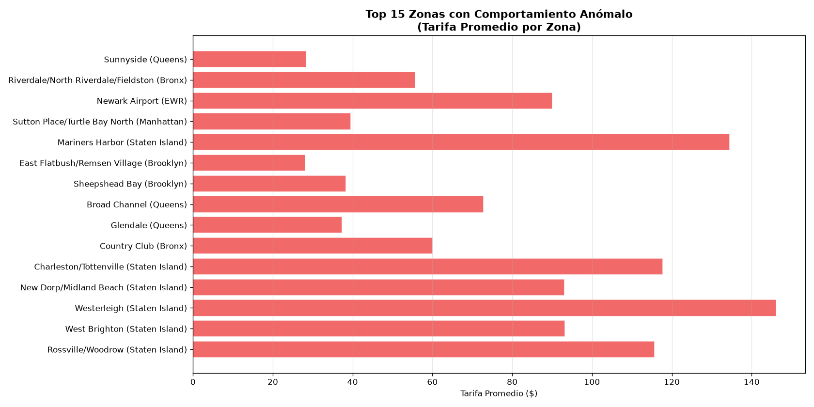
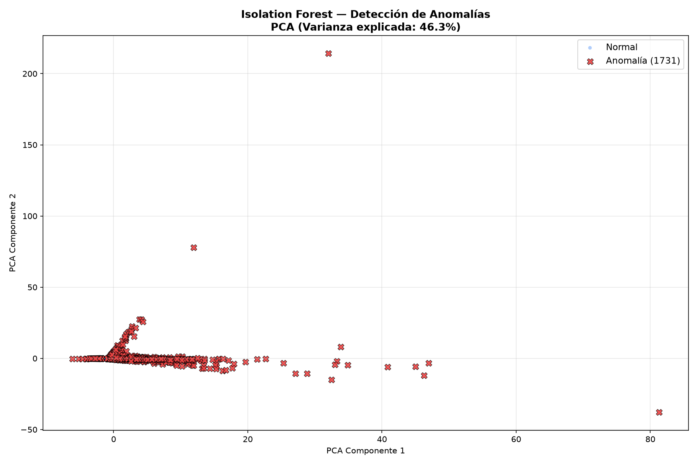

# Resultados de Modelos de Machine Learning (Capa Gold)

Este documento resume los hallazgos y resultados obtenidos tras ejecutar los tres pipelines de Machine Learning sobre los Data Marts de la capa Gold.

---

## 1. Pronóstico de Demanda con SARIMA (Notebook 08)
**Objetivo:** Predecir el volumen de viajes por hora a nivel ciudad para los próximos 7 días utilizando series de tiempo estacionales.

### Estadísticas Descriptivas de la Serie de Tiempo

| Métrica | Valor |
| :--- | :--- |
| **Observaciones (Horas)** | 26,304 |
| **Media de Viajes/Hora** | 33,391.0 |
| **Desviación Estándar** | 13,910.8 |
| **Mínimo Histórico** | 95.0 |
| **Mediana (50%)** | 37,002.5 |
| **Máximo Histórico** | 76,036.0 |

### Resultados de Estacionariedad (Augmented Dickey-Fuller)

| Métrica | Valor | Interpretación |
| :--- | :--- | :--- |
| **ADF Statistic** | -18.7692 | Supera umbrales críticos |
| **p-value** | 0.000000 | Altamente significativo |
| **Critical Value (1%)** | -3.4306 | - |
| **Resultado Final** | **Estacionaria (d=0)** | Se usa SARIMA debido a la fuerte estacionalidad |

**Modelo Seleccionado:** `SARIMA(1, 1, 1) × (1, 1, 1, 24)`
**Pronóstico a 7 días (168h):** Demanda promedio predicha de **42,567 viajes/hora**.

### Gráficos
#### Serie de Tiempo Original

#### Análisis de Autocorrelación (ACF / PACF)

#### Pronóstico a 7 Días

---

## 2. Segmentación Espacial de Zonas con K-Means (Notebook 09)
**Objetivo:** Agrupar las 264 zonas de taxi en Nueva York según perfiles operativos y financieros.

### Distribución Final de Zonas y Volumen Histórico

| Perfil de Zona (Cluster) | N° de Zonas | Viajes Históricos Totales | Ingreso Acumulado ($) |
| :--- | :--- | :--- | :--- |
| **Zona Premium (Alto Tráfico)** | 55 | 429,114,076 | $15,776,650,000 |
| **Zona Residencial** | 125 | 243,745,794 | $6,528,190,000 |
| **Zona Comercial (Tráfico Medio)**| 60 | 143,048,534 | $3,223,545,000 |
| **Zona Marginal (Bajo Tráfico)** | 24 | 14,020,312 | $390,716,200 |

### Perfil Promedio Mensual por Zona según el Cluster

| Cluster (K) | Viajes | Ingreso Bruto | Propina Promedio | % Dan Propina | Tarifa Prom. | Duración Prom. | Distancia Prom. | Hora Pico |
| :--- | :--- | :--- | :--- | :--- | :--- | :--- | :--- | :--- |
| **0 (Comercial)** | 1.94M | $52.2M | $1.03 | 16% | $27.12 | 23.7 min | 4.19 mi | 11:30 AM |
| **1 (Marginal)** | 0.58M | $16.2M | $2.65 | 22% | $42.89 | 35.6 min | 5.38 mi | 1:00 PM |
| **2 (Residencial)** | 2.38M | $53.7M | $0.41 | 7% | $25.50 | 70.2 min | 4.76 mi | 1:30 PM |
| **3 (Premium)** | 7.80M | $286.8M | $1.05 | 22% | $22.77 | 27.0 min | 3.54 mi | 4:30 PM |

### Gráficos
#### Método del Codo (Elbow) para selección de K

#### Clusters Visualizados (PCA)

---

## 3. Detección de Anomalías con Isolation Forest (Notebook 10)
**Objetivo:** Identificar comportamientos atípicos en el perfil operativo y financiero combinando zona, vehículo y mes.

### Resultados de Detección (Top 5% más atípico)

| Clasificación de Registros | Cantidad (Zonas x Mes) | Porcentaje del Total |
| :--- | :--- | :--- |
| **Comportamiento Normal** | 32,885 | 95.0% |
| **Anomalías Detectadas** | 1,731 | 5.0% |
| **Total Evaluados** | 34,616 | 100.0% |

### Gráficos
#### Top Zonas Anómalas

#### Distribución de Anomalías en PCA

