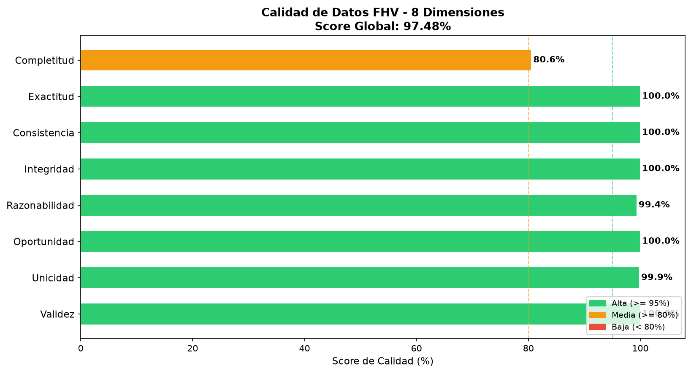

# Análisis de Calidad de Datos: FHV (For-Hire Vehicles)

El conjunto de datos FHV comprende vehículos de alquiler (Livery, Black Car, Luxury Limo) que despachan viajes pre-acordados, excluyendo a los masivos Uber/Lyft (que pertenecen a HVFHV). Sus datos son muy reducidos comparados con un taxi tradicional.

**Score Global de Calidad: 97.48%**

## Dimensiones Evaluadas

### Dimension 1: Completitud

| Regla / Campo | Resultado |
|---|---|
| Total de registros | 58,536,509 |
| Campo "dispatching_base_num" | 0 nulos | 100.00% completo |
| Campo "pickup_datetime" | 0 nulos | 100.00% completo |
| Campo "dropOff_datetime" | 0 nulos | 100.00% completo |
| Campo "PUlocationID" | 46,919,807 nulos | 19.85% completo |
| Campo "DOlocationID" | 9,917,182 nulos | 83.06% completo |
**Score Completitud**: 80.58%
**Registros fallidos (suma de nulos por campo)**: 56,836,989

### Dimension 2: Exactitud

| Regla / Campo | Resultado |
|---|---|
| dispatching_base_num no comienza con "B" | 798 registros |
| SR_Flag con valor invalido (no nulo ni "1") | 0 registros |
**Score Exactitud**: 100.00%
**Registros fallidos**: 798

### Dimension 3: Consistencia

| Regla / Campo | Resultado |
|---|---|
| pickup_datetime >= dropOff_datetime (orden incorrecto) | 337 registros |
| Viajes con duracion exactamente 0 segundos | 44 registros |
**Score Consistencia**: 100.00%
**Registros fallidos**: 337

### Dimension 4: Integridad

| Regla / Campo | Resultado |
|---|---|
| PUlocationID fuera de rango [1-265] | 0 registros |
| DOlocationID fuera de rango [1-265] | 0 registros |
**Score Integridad**: 100.00%
**Registros fallidos**: 0

### Dimension 5: Razonabilidad

| Regla / Campo | Resultado |
|---|---|
| Duracion fuera de rango [1 min - 12 hrs] | 357,666 registros |
| Hora de recogida fuera de rango [0-23] | 0 registros |
**Score Razonabilidad**: 99.39%
**Registros fallidos**: 357,666

### Dimension 6: Oportunidad

| Regla / Campo | Resultado |
|---|---|
| Distribucion de registros por anio de recogida |  |
| anio_recogida | count |
|---|---|
| 2023 | 15858639 |
| 2024 | 17630326 |
| 2025 | 25047544 |
| Registros fuera del rango [2019-2025] | 0 |
**Score Oportunidad**: 100.00%

### Dimension 7: Unicidad

| Regla / Campo | Resultado |
|---|---|
| Grupos de registros duplicados encontrados | 64,989 |
| Total de registros excedentes (duplicados) | 79,357 |
**Registros unicos**: 58,457,152
**Score Unicidad**: 99.86%

### Dimension 8: Validez

| Regla / Campo | Resultado |
|---|---|
| dispatching_base_num con longitud fuera de [4-6] | 0 registros |
| pickup_datetime con anio <= 2000 (posible epoch o error) | 0 registros |
| PUlocationID <= 0 | 0 registros |
**Score Validez**: 100.00%
**Registros fallidos**: 0

## Resultados Visuales

