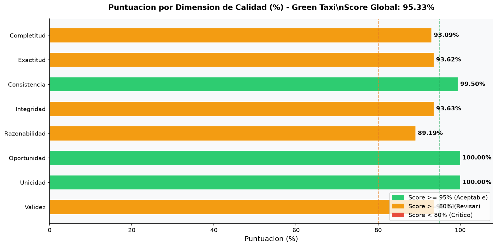

# Análisis de Calidad de Datos: Green Taxi

El dataset de Green Taxi abarca los "Boro Taxis" (verdes), autorizados a recoger pasajeros solo fuera de Manhattan central y aeropuertos.

**Score Global de Calidad: 95.33%**

## Dimensiones Evaluadas (Detalle Tabular)

### Dimension 1: Completitud

| Columna | Completitud (%) |
|---|---|
| VendorID | 100.00% [OK] |
| lpep_pickup_datetime | 100.00% [OK] |
| lpep_dropoff_datetime | 100.00% [OK] |
| store_and_fwd_flag | 93.63% [AVISO] |
| RatecodeID | 93.63% [AVISO] |
| PULocationID | 100.00% [OK] |
| DOLocationID | 100.00% [OK] |
| passenger_count | 93.63% [AVISO] |
| trip_distance | 100.00% [OK] |
| fare_amount | 100.00% [OK] |
| extra | 100.00% [OK] |
| mta_tax | 100.00% [OK] |
| tip_amount | 100.00% [OK] |
| tolls_amount | 100.00% [OK] |
| ehail_fee | 0.00% [CRITICO] |
| improvement_surcharge | 100.00% [OK] |
| total_amount | 100.00% [OK] |
| payment_type | 93.63% [AVISO] |
| trip_type | 93.62% [AVISO] |
| congestion_surcharge | 93.63% [AVISO] |
**Score de Completitud**: 93.09%
**Registros con al menos un nulo**: 2,038,653

### Dimension 2: Exactitud

| Campo | Registros Fuera de Catalogo |
|---|---|
| VendorID | 27,085 |
| payment_type | 129,821 |
| RatecodeID | 129,821 |
| store_and_fwd_flag | 0 |
| trip_type | 129,995 |
**Registros fallidos (cualquier campo)**: 129,995
**Score de Exactitud**: 93.62%

### Dimension 3: Consistencia

| Regla | Registros Fallidos |
|---|---|
| pickup < dropoff datetime | 3,605 |
| total_amount >= fare_amount | 6,666 |
| tip_amount >= 0 con pago tarjeta | 1 |
| trip_type coherente [1,2] | 0 |
**Registros fallidos en alguna regla**: 10,170
**Score de Consistencia**: 99.50%

### Dimension 4: Integridad Referencial

| Campo | Referencia | Fallidos |
|---|---|---|
| PULocationID | Zonas TLC 1-265 | 0 |
| DOLocationID | Zonas TLC 1-265 | 0 |
| RatecodeID | [1,2,3,4,5,6,99] | 129,821 |
| VendorID | [1,2] | 27,085 |
**Registros con algun ID fuera de catalogo**: 129,821
**Score de Integridad**: 93.63%

### Dimension 5: Razonabilidad

| Regla | Rango | Fallidos |
|---|---|---|
| trip_distance | [0, 200] millas | 1,002 |
| fare_amount | [0, 1000] USD | 6,111 |
| total_amount | [0, 1000] USD | 6,201 |
| passenger_count | [1, 6] | 151,466 |
| duracion del viaje | [1, 480] min | 71,630 |
| tip_amount | >= 0 | 190 |
**Registros fuera de rango en alguna regla**: 220,418
**Score de Razonabilidad**: 89.19%

### Dimension 6: Oportunidad

| Anio | Registros | % del Total | Estado |
|---|---|---|---|
| 2008 | 7 | 0.00% FUERA DE RANGO |  |
| 2009 | 6 | 0.00% FUERA DE RANGO |  |
| 2022 | 2 | 0.00% | VALIDO |
| 2023 | 787,055 | 38.61% | VALIDO |
| 2024 | 660,204 | 32.38% | VALIDO |
| 2025 | 591,365 | 29.01% | VALIDO |
| 2026 | 14 | 0.00% FUERA DE RANGO |  |
**Registros fuera de rango**: 27
**Score de Oportunidad**: 100.00%

### Dimension 7: Unicidad

**Columnas clave para deteccion de duplicados**: 
- lpep_pickup_datetime
- lpep_dropoff_datetime
- PULocationID
- DOLocationID
- total_amount
**Total de registros**: 2,038,653
**Grupos con duplicados encontrados**: 0
**Registros duplicados adicionales (extras)**: 0
**Registros unicos**: 2,038,653
**Score de Unicidad**: 100.00%

### Dimension 8: Validez

| Regla de Formato | Fallidos |
|---|---|
| store_and_fwd_flag en [Y, N] y no nulo | 129,821 |
| VendorID entero no nulo | 0 |
| lpep_pickup_datetime no nulo y anio > 2000 | 0 |
| lpep_dropoff_datetime no nulo y anio > 2000 | 0 |
| PULocationID entero positivo | 0 |
| DOLocationID entero positivo | 0 |
**Registros con alguna falla de formato**: 129,821
**Score de Validez**: 93.63%

## Resultados Visuales

