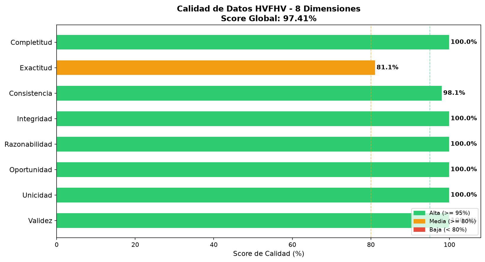

# Análisis de Calidad de Datos: HVFHV (High Volume For-Hire Vehicles)

El dataset de HVFHV es el más gigantesco del proyecto. Engloba los despachos de plataformas de alta demanda (Uber, Lyft, Via) en la ciudad, acumulando cientos de millones de registros.

**Score Global de Calidad: 97.41%**

## Dimensiones Evaluadas (Detalle Tabular)

### Dimension 1: Completitud

**Total de registros**: 715,550,152
**Campo "hvfhs_license_num"**: 0 nulos | 100.00% completo
**Campo "dispatching_base_num"**: 0 nulos | 100.00% completo
**Campo "pickup_datetime"**: 0 nulos | 100.00% completo
**Campo "dropoff_datetime"**: 0 nulos | 100.00% completo
**Campo "PULocationID"**: 0 nulos | 100.00% completo
**Campo "DOLocationID"**: 0 nulos | 100.00% completo
**Campo "base_passenger_fare"**: 0 nulos | 100.00% completo
**Campo "driver_pay"**: 0 nulos | 100.00% completo
**Score Completitud**: 100.00%
**Registros fallidos (suma de nulos por campo)**: 0

### Dimension 2: Exactitud

**hvfhs_license_num fuera de catalogo ['HV0002', 'HV0003', 'HV0004', 'HV0005']**: 0 registros
**shared_request_flag con valor invalido (no Y ni N)**: 0 registros
**shared_match_flag con valor invalido (no Y ni N)**: 0 registros
**access_a_ride_flag con valor invalido (no Y ni N)**: 134,931,167 registros
**wav_request_flag con valor invalido (no Y ni N)**: 0 registros
**wav_match_flag con valor invalido (no Y ni N)**: 0 registros
**Score Exactitud**: 81.14%
**Registros fallidos**: 134,931,167

### Dimension 3: Consistencia

**request_datetime > pickup_datetime**: 7,390,312 registros
**pickup_datetime >= dropoff_datetime (orden incorrecto)**: 30,418 registros
**driver_pay > base_passenger_fare * 1.5**: 6,352,127 registros
**trip_time <= 0 cuando trip_miles > 0**: 4 registros
**Score Consistencia**: 98.12%
**Registros fallidos**: 13,487,763

### Dimension 4: Integridad

**PULocationID fuera de rango [1-265]**: 0 registros
**DOLocationID fuera de rango [1-265]**: 0 registros
**hvfhs_license_num fuera del catalogo HVFHV**: 0 registros
**Score Integridad**: 100.00%
**Registros fallidos**: 0

### Dimension 5: Razonabilidad

**trip_miles fuera de rango [0-300]**: 152 registros
**base_passenger_fare fuera de rango [0-1000]**: 100,883 registros
**driver_pay fuera de rango [0-800]**: 6,091 registros
**trip_time fuera de rango [60-43200 segundos]**: 58,714 registros
**tips negativos**: 0 registros
**Score Razonabilidad**: 99.98%
**Registros fallidos**: 163,580

### Dimension 6: Oportunidad

**Distribucion de registros por anio de recogida**: 
+-------------+---------+
|anio_recogida|count    |
+-------------+---------+
|2023         |232490020|
|2024         |239470448|
|2025         |243589684|
+-------------+---------+
**Registros fuera del rango [2019-2025]**: 0
**Score Oportunidad**: 100.00%

### Dimension 7: Unicidad

**Grupos de registros duplicados encontrados**: 4,577
**Total de registros excedentes (duplicados)**: 4,577
**Registros unicos**: 715,545,575
**Score Unicidad**: 100.00%

### Dimension 8: Validez

**dispatching_base_num no comienza con "B"**: 0 registros
**hvfhs_license_num no coincide con patron HV[0-9]{4}**: 0 registros
**shared_request_flag con longitud != 1**: 0 registros
**shared_match_flag con longitud != 1**: 0 registros
**access_a_ride_flag con longitud != 1**: 0 registros
**wav_request_flag con longitud != 1**: 0 registros
**wav_match_flag con longitud != 1**: 0 registros
**trip_time con parte decimal (no entero)**: 0 registros
**Score Validez**: 100.00%
**Registros fallidos**: 0

## Resultados Visuales

