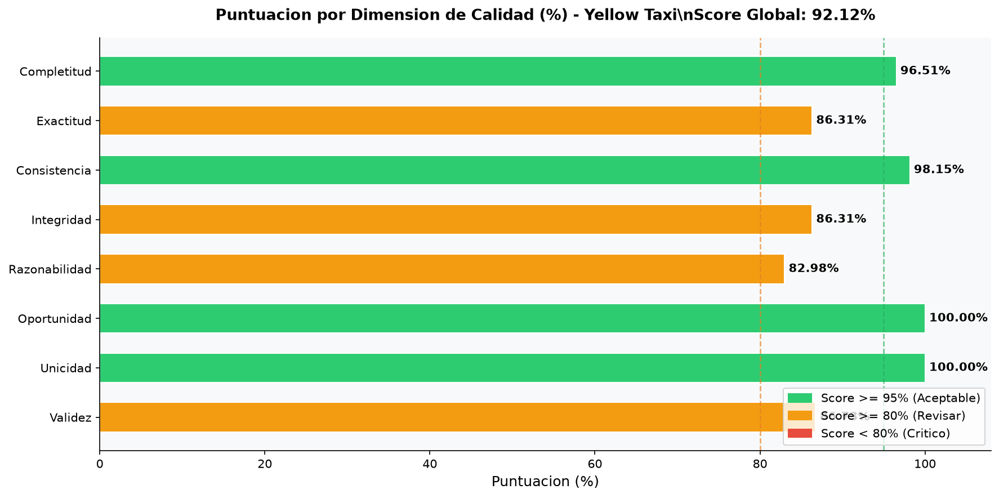

# Análisis de Calidad de Datos: Yellow Taxi

El dataset de Yellow Taxi representa los tradicionales taxis amarillos de la ciudad de Nueva York. 
Este conjunto es uno de los más grandes y de mayor calidad de la TLC. 

**Score Global de Calidad: 92.12%**

## Dimensiones Evaluadas

### Dimension 1: Completitud

| Columna | Completitud (%) |
|---|---|
| VendorID | 100.00% [OK] |
| tpep_pickup_datetime | 100.00% [OK] |
| tpep_dropoff_datetime | 100.00% [OK] |
| passenger_count | 86.73% [AVISO] |
| trip_distance | 100.00% [OK] |
| RatecodeID | 86.73% [AVISO] |
| store_and_fwd_flag | 86.73% [AVISO] |
| PULocationID | 100.00% [OK] |
| DOLocationID | 100.00% [OK] |
| payment_type | 100.00% [OK] |
| fare_amount | 100.00% [OK] |
| extra | 100.00% [OK] |
| mta_tax | 100.00% [OK] |
| tip_amount | 100.00% [OK] |
| tolls_amount | 100.00% [OK] |
| improvement_surcharge | 100.00% [OK] |
| total_amount | 100.00% [OK] |
| congestion_surcharge | 86.73% [AVISO] |
| airport_fee | 86.73% [AVISO] |
**Score de Completitud**: 96.51%
**Registros con al menos un nulo**: 17,012,482

### Dimension 2: Exactitud

| Campo | Registros Fuera de Catalogo |
|---|---|
| VendorID | 570,850 |
| payment_type | 17,012,482 |
| RatecodeID | 17,012,482 |
| store_and_fwd_flag | 0 |
**Registros fallidos (cualquier campo)**: 17,548,613
**Score de Exactitud**: 86.31%

### Dimension 3: Consistencia

| Regla | Registros Fallidos |
|---|---|
| pickup < dropoff datetime | 575,383 |
| total_amount >= fare_amount | 1,792,578 |
| tip_amount >= 0 con pago tarjeta | 881 |
**Registros fallidos en alguna regla**: 2,367,762
**Score de Consistencia**: 98.15%

### Dimension 4: Integridad Referencial

| Campo | Referencia | Fallidos |
|---|---|---|
| PULocationID | Zonas TLC 1-265 | 0 |
| DOLocationID | Zonas TLC 1-265 | 0 |
| RatecodeID | [1,2,3,4,5,6,99] | 17,012,482 |
| VendorID | [1,2] | 570,850 |
**Registros con algun ID fuera de catalogo**: 17,548,613
**Score de Integridad**: 86.31%

### Dimension 5: Razonabilidad

| Regla | Rango | Fallidos |
|---|---|---|
| trip_distance | [0, 200] millas | 4,369 |
| fare_amount | [0, 1000] USD | 3,961,414 |
| total_amount | [0, 1000] USD | 1,960,107 |
| passenger_count | [1, 6] | 18,257,742 |
| duracion del viaje | [1, 480] min | 2,099,713 |
| tip_amount | >= 0 | 4,812 |
**Registros fuera de rango en alguna regla**: 21,824,610
**Score de Razonabilidad**: 82.98%

### Dimension 6: Oportunidad

| Anio | Registros | % del Total | Estado |
|---|---|---|---|
| 2001 | 6 | 0.00% FUERA DE RANGO |  |
| 2002 | 22 | 0.00% FUERA DE RANGO |  |
| 2003 | 6 | 0.00% FUERA DE RANGO |  |
| 2007 | 1 | 0.00% FUERA DE RANGO |  |
| 2008 | 34 | 0.00% FUERA DE RANGO |  |
| 2009 | 39 | 0.00% FUERA DE RANGO |  |
| 2014 | 1 | 0.00% FUERA DE RANGO |  |
| 2022 | 36 | 0.00% | VALIDO |
| 2023 | 38,310,132 | 29.88% | VALIDO |
| 2024 | 41,169,691 | 32.11% | VALIDO |
| 2025 | 48,722,578 | 38.00% | VALIDO |
| 2026 | 2 | 0.00% FUERA DE RANGO |  |
**Registros fuera de rango**: 111
**Score de Oportunidad**: 100.00%

### Dimension 7: Unicidad

**Columnas clave para deteccion de duplicados**: 
- tpep_pickup_datetime
- tpep_dropoff_datetime
- PULocationID
- DOLocationID
- total_amount
**Total de registros**: 128,202,548
**Grupos con duplicados encontrados**: 28
**Registros duplicados adicionales (extras)**: 28
**Registros unicos**: 128,202,520
**Score de Unicidad**: 100.00%

### Dimension 8: Validez

| Regla de Formato | Fallidos |
|---|---|
| store_and_fwd_flag en [Y, N] y no nulo | 17,012,482 |
| VendorID entero no nulo | 0 |
| tpep_pickup_datetime no nulo y anio > 2000 | 0 |
| tpep_dropoff_datetime no nulo y anio > 2000 | 1 |
| PULocationID entero positivo | 0 |
| DOLocationID entero positivo | 0 |
**Registros con alguna falla de formato**: 17,012,483
**Score de Validez**: 86.73%

## Resultados Visuales

